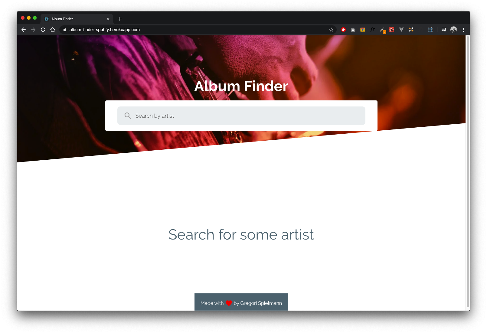
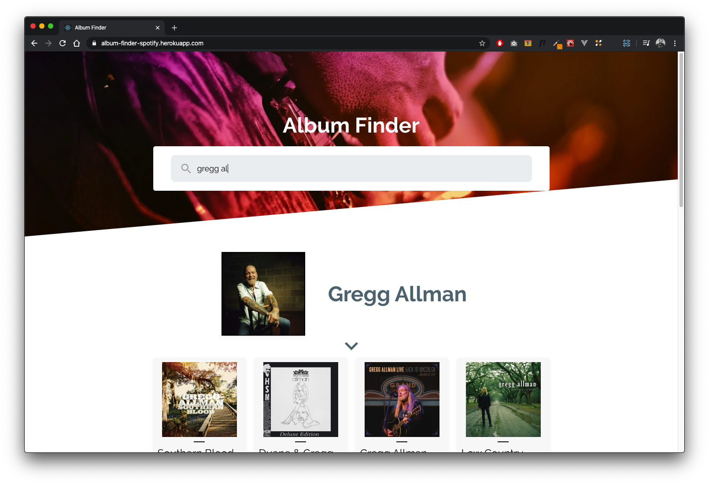

## A simple Album Finder App with Spotify GraphQL API

### Live Demo

You can view the demo on [https://album-finder-spotify.netlify.com/](Live Demo).

### Screenshots

<div style="display: flex; width: 100%;">
  </img>
  </img>
</div>

### How to run?

Clone this repo and choose a mode below to run!

> Running on deployment mode.<br />

```

$ yarn && yarn start

```

Open [http://localhost:3000](http://localhost:3000) to view it in the browser.

> Running on production mode

```

$ yarn && yarn build && yarn server

```

Open [http://localhost:9000](http://localhost:9000) to view it in the browser.

### Made with :heart: by Gregori Spielmann
